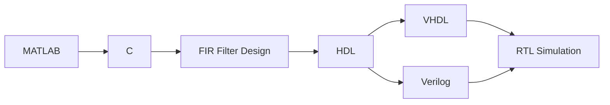

# ecg-fir-hdl

## Workflow

## Requirements

- [GHDL](https://github.com/ghdl/ghdl) for VHDL simulation.
- [Icarus Verilog](https://github.com/steveicarus/iverilog) for Verilog simulation.
- [Surfer](https://github.com/samitbasu/surfer-project-rhdl) for waveform visualization.
- [VHDL Style Guide](https://github.com/jeremiah-c-leary/vhdl-style-guide) for VHDL linting and formatting.
- [Verible](https://github.com/chipsalliance/verible) for Verilog linting and formatting.

## Usage

...
