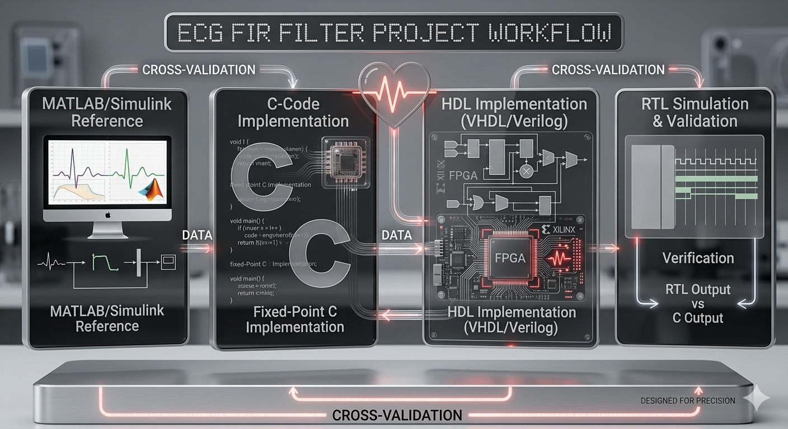

<h1 align="center">
    <br>
    
    <br>
    ElectroCardioGram FIR Filter in HDL
    <br>
</h1>


## Requirements

- [GHDL](https://github.com/ghdl/ghdl) for VHDL simulation.
- [Icarus Verilog](https://github.com/steveicarus/iverilog) for Verilog simulation.
- [Surfer](https://github.com/samitbasu/surfer-project-rhdl) for waveform visualization.
- [VHDL Style Guide](https://github.com/jeremiah-c-leary/vhdl-style-guide) for VHDL linting and formatting.
- [Verible](https://github.com/chipsalliance/verible) for Verilog linting and formatting.

## Usage

### Clone the repository

First clone the repository and navigate into it:

```bash
git clone https://github.com/AntonioBerna/ecg-fir-hdl.git
cd ecg-fir-hdl
```

### FIR Filter Design using MATLAB

You can run the MATLAB script using MATLAB Online or locally if you have MATLAB installed. The script generates the FIR filter coefficients (impulse response) reported below:

```bash
-1, -1, 1, 13, 32, 41, 32, 13, 1, -1, -1
```

> [!NOTE]
> The MATLAB script describe all the steps to design the FIR filter, including the choice of the window function and the cutoff frequencies, plotting the impulse response and the frequency response of the filter, and finally generating the coefficients. You can modify the script to design different FIR filters by changing the parameters such as the filter order, cutoff frequencies, and window type.
> The generated coefficients are used in both the VHDL and Verilog implementations of the FIR filter.

### FIR Filter Design with Transposed Form in C

After generating the coefficients, you can run the C program to implement the FIR filter using the transposed form. The program reads the input signal from a file, applies the FIR filter, and writes the output signal to another file. You can modify the input signal and test different scenarios.

```bash
# Compile the C program
make fir

# Run the FIR filter
make fir-run

# Clean generated files
make clean
```

### FIR Filter Design in VHDL and Verilog

```bash
# Run the HDL design and simulation
make vhdl-run
make verilog-run

# View the generated waveform
make vhdl-surfer
make verilog-surfer

# Clean generated files
make clean
```

### Extra commands

Following commands are available to generate all the outputs at once, including the paper PDF, and to clean generated files.

```bash
# Generate all-in-one: C, HDL and paper
make

# Format and lint the HDL code
make format # Both VHDL and Verilog
make format-vhdl
make format-verilog

# Generate the paper PDF
make paper

# Clean generated PDF
make clean-pdf
```
